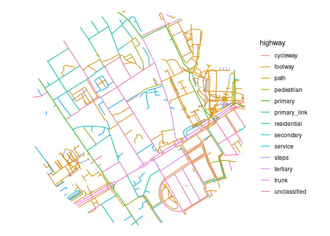

Let’s get OSM data

# With R

``` r
library(osmextract)
library(tidyverse)
```

## ATI OSM data

``` r
ATI_centroid = c(-0.12892, 51.53014)
ATI_sf = sf::st_as_sf(
    data.frame(
        x = ATI_centroid[1],
        y = ATI_centroid[2]
    ),
    coords = c("x", "y"),
    crs = 4326
)
```

We’ll buffer a temporarily transformed point to get the area of
interest.

``` r
ATI_buffer = stplanr::geo_buffer(ATI_sf, dist = 500, crs = 27700)
```

Let’s get the data from OSM

``` r
extra_tags = c(
    # Max speed:
    "maxspeed",
    # Road ref:
    "ref",
    # Lit:
    "lit",
    # Surface:
    "surface",
    "cycleway",
    "cycleway:left",
    "cycleway:right",
    "cycleway:both",
    "cycleway:lane",
    "cycleway:opposite",
    # sidewalk tags:
    "sidewalk",
    "sidewalk:left",
    "sidewalk:right"
)
ATI_osm = osmextract::oe_get_network(
    ATI_buffer,
    mode = "walking",
    boundary = ATI_buffer,
    boundary_type = "clipsrc",
    extra_tags = extra_tags
)
```

    0...10...20...30...40...50...60...70...80...90...100 - done.
    Reading layer `lines' from data source 
      `/home/robin/data/osm/geofabrik_greater-london-latest.gpkg' 
      using driver `GPKG'
    Simple feature collection with 1073 features and 25 fields
    Geometry type: MULTILINESTRING
    Dimension:     XY
    Bounding box:  xmin: -0.1359963 ymin: 51.52565 xmax: -0.1217338 ymax: 51.5346
    Geodetic CRS:  WGS 84

``` r
names(ATI_osm)
```

     [1] "osm_id"            "name"              "highway"          
     [4] "waterway"          "aerialway"         "barrier"          
     [7] "man_made"          "access"            "foot"             
    [10] "service"           "maxspeed"          "ref"              
    [13] "lit"               "surface"           "cycleway"         
    [16] "cycleway_left"     "cycleway_right"    "cycleway_both"    
    [19] "cycleway_lane"     "cycleway_opposite" "sidewalk"         
    [22] "sidewalk_left"     "sidewalk_right"    "z_order"          
    [25] "other_tags"        "geometry"         

The data can be plotted as follows with `ggplot2`

``` r
ATI_osm %>%
  ggplot() +
  geom_sf(aes(color = highway)) +
  theme_void()
```



Let’s save it as a JSON file:

``` r
sf::write_sf(ATI_osm, "../examples/minimal/ATI_osm.geojson", delete_dsn = TRUE)
```

# With Python

``` python
import osmnx as ox
```

We’ll download OSM data in the 1 km boundary surrounding the British
Library in London.

``` python
# get the boundary polygon
case_study_centre = ox.geocode_to_gdf('British Library, London, UK')
case_study_polygon = ox.project_gdf(case_study_centre).unary_union
case_study_1km_boundary = ox.project_gdf(case_study_centre).unary_union.buffer(1000)
# Convert to gdf:
```

We’ll install the OSM2AT package as follows

``` bash
gh repo clone acteng/OSM2AT
cd OSM2AT
pip install -e .
```

``` python
import OSM2AT
```

``` python
bbox = case_study_1km_boundary

lts_method = 'ottawa'
self_learn_k = 5

#Cycle network
impute_method = 'mode-rule'
mlp_train_params = {
    'hidden_layer' : 100,
    'n_epochs' : 50,
    'batch_size' : 10
}

# Get osmnx cycle network:
G = ox.graph_from_polygon(bbox, network_type='all_private', simplify=False, retain_all=True, truncate_by_edge=True, clean_periphery=True)

G,edges = OSM2AT.get_cycle_network(bbox,impute_method,mlp_train_params,lts_method,self_learn_k)
```

``` python
# Explore in interactive map with explore()
```
